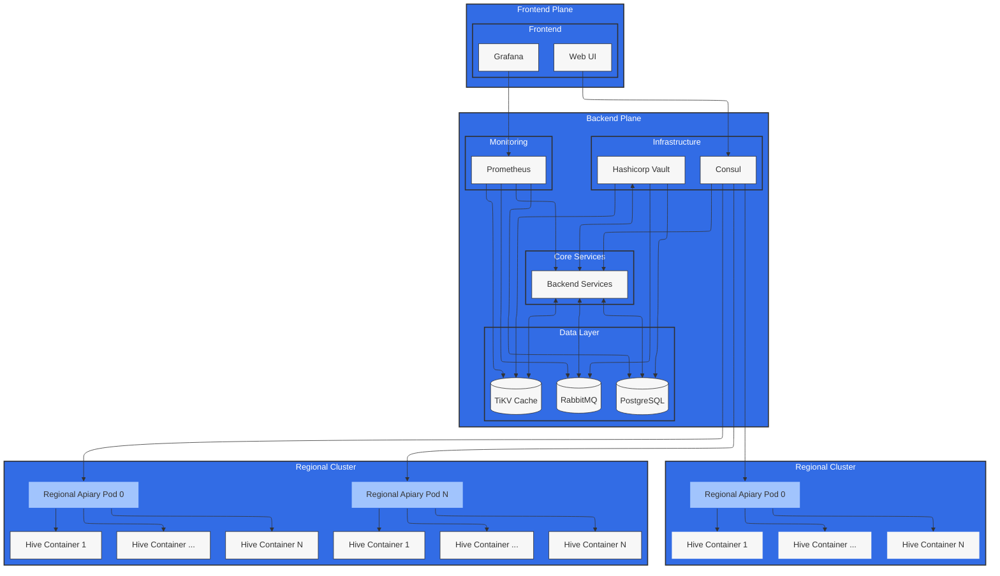

# Project README

## Overview

This "BeesBiz" project focuses on the literal management of beekeeping operations. It provides tools for tracking and monitoring bee health, hive conditions, and honey production.

## Architecture Components

### Front End

- **Grafana**: Visualization and monitoring tool that interfaces with Prometheus to display metrics and analytics.
- **Web UI**: User interface that interacts with the backend services.

### Core Services

- **Backend Services**: The core logic and processing unit of the application, handling business operations and data processing.
- **API Gateway**: Acts as a single entry point for the frontend to access backend services and routes requests accordingly. (TO BE IMPLEMENTED)

### Data Layer

- **RabbitMQ (RMQ)**: A message broker that facilitates asynchronous communication between services.
- **PostgreSQL (PG)**: Relational database for persistent data storage.
- **TiKV Cache**: A distributed transactional key-value storage system for caching and fast access to frequently used data. (TO BE IMPLEMENTED)

### Infrastructure (TO BE IMPLEMENTED)

- **Hashicorp Vault**: Manages secrets and sensitive data, ensuring secure access to credentials and configuration.
- **Consul**: Provides service discovery and configuration capabilities, enabling services to find each other in a dynamic environment.

### Monitoring

- **Prometheus**: Monitoring and alerting toolkit that collects metrics from configured services and stores them for analysis.

### Data Mockup

- **hive.rs**: Custom genserver (via actix) rust service that simulates the hive sensor data.

## Diagram Legend

- **Clusters**:

  - Front End
  - Core Services
  - Data Layer
  - Infrastructure
  - Monitoring
  - Geo-Regions

- **Component Classifications**:
  - **Apiary**: Denotes pod-level services that handle specific group of hives.
  - **Hive**: Represents individual hive.

## Getting Started

To set up the project locally:

1. Clone the repository.
2. Install dependencies.
3. Configure the environment variables for the database and messaging services.
4. Start the application using Docker or your preferred method.
5. Access the Web UI at `http://localhost:PORT` and monitor with Grafana at `http://localhost:GRAFANA_PORT`.

## Contributing

Contributions are welcome! Please feel free to submit a pull request or open an issue for any enhancements or bugs.

## License

See LICENSE
