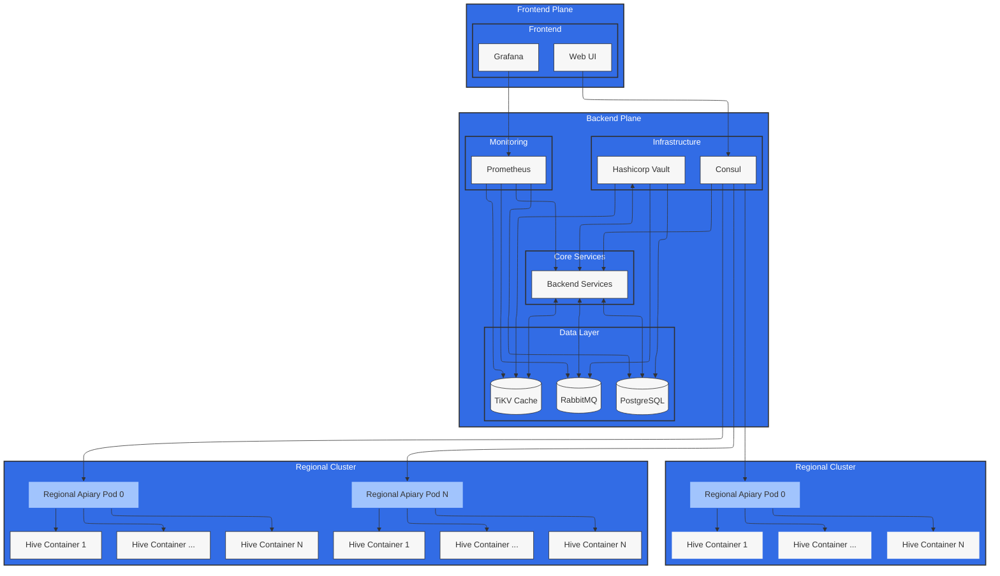

# Architecture overview

```mermaid
---
config:
  layout: elk
---
graph TB
    subgraph "Frontend Plane"
        subgraph "Frontend"
            Grafana[Grafana]
            UI[Web UI]
        end
    end

    subgraph "Backend Plane"
        subgraph "Core Services"
            BE[Backend Services]
        end
        subgraph "Data Layer"
            RMQ[(RabbitMQ)]
            PG[(PostgreSQL)]
            TiKV[(TiKV Cache)]
        end
        subgraph "Infrastructure"
            Gateway[Consul]
            Vault[Hashicorp Vault]
        end
        subgraph "Monitoring"
            Prometheus[Prometheus]
        end
    end

    subgraph "Regional Cluster"
        direction TB
        Gateway --> AP1[Regional Apiary Pod 0]
        AP1 --> H11[Hive Container ...] & H12[Hive Container N] & H13[Hive Container 1]
    end

    subgraph "Regional Cluster"
        direction TB
        Gateway --> AP2[Regional Apiary Pod 0]
        Gateway --> AP3[Regional Apiary Pod N]
        AP2 --> H21[Hive Container ...] & H22[Hive Container N] & H23[Hive Container 1]
        AP3 --> H31[Hive Container ...] & H32[Hive Container N] & H33[Hive Container 1]
    end

    UI --> Gateway
    BE <--> RMQ & PG & TiKV
    Vault --> RMQ & PG & TiKV
    Gateway --> BE
    Vault <--> BE
    Prometheus -->  BE & PG & RMQ & TiKV
    Grafana --> Prometheus

    classDef default fill:#F7F7F7,stroke:#303030,stroke-width:1px;
    classDef cluster fill:#326CE5,stroke:#303030,stroke-width:2px,color:#fff;
    classDef apiary fill:#A1C4FD,stroke:#326CE5,stroke-width:3px;
    classDef hive fill:#F7F7F7,stroke:#326CE5,stroke-width:1px;
    class GC1,GC2,GC3 cluster;
    class AP1,AP2,AP3 apiary;
    class H11,H12,H13 hive;

```
