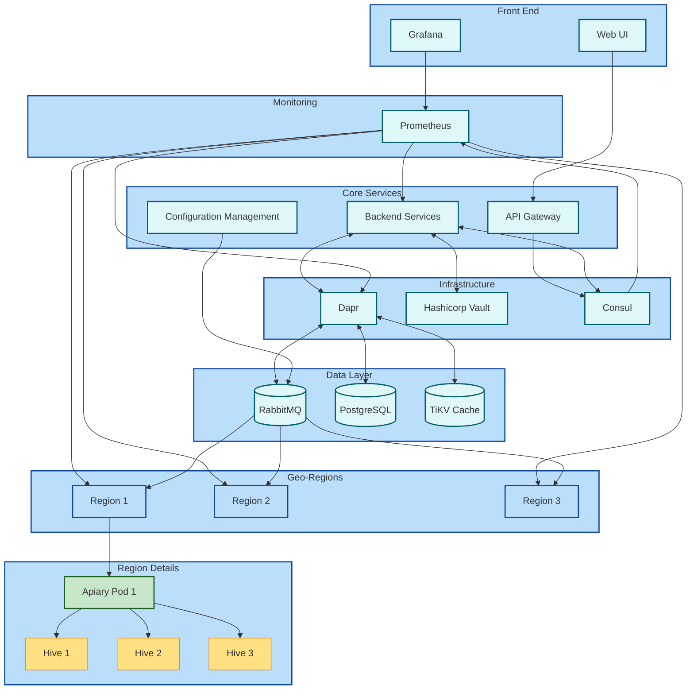

# 1. Предметная область: 

Гео-распределенная система управления и мониторинга пасек

# 2. Описание предметной области:

Система предназначена для управления и мониторинга пасек, расположенных в различных географических регионах. Каждый регион имеет свой кластер, который отвечает за управление местными пасеками. Пасека состоит из множества ульев, каждый из которых содержит пчелиную семью. 

# 3. Зачем она нужна и какие задачи позволит решить:

Система позволяет отслеживать состояние ульев, здоровье пчелиных семей, планировать работы по обслуживанию, вести учет медосбора и производства других продуктов пчеловодства. Она также обеспечивает централизованный мониторинг всех пасек, независимо от их географического расположения.

А также

- Повышение эффективности управления пасеками за счет автоматизации процессов мониторинга и контроля
- Улучшение здоровья пчелиных семей путем раннего выявления проблем
- Оптимизация производства меда и других продуктов пчеловодства
- Снижение затрат на обслуживание пасек
- Обеспечение централизованного управления распределенными пасеками
- Повышение качества и скорости принятия решений на основе анализа данных

# 4. Функциональные требования и нефункциональные требования

### 3.1 Функциональные требования

#### 3.1.1 Мониторинг ульев
Система должна обеспечивать:
- Мониторинг температуры и влажности в ульях в реальном времени
- Настройку оповещений при выходе параметров за допустимые пределы

#### 3.1.2 Учет состояния пчелиных семей
Система должна позволять:
- Вести учет здоровья и численности пчелиных семей
- Фиксировать результаты осмотров
- Отслеживать динамику развития семей

#### 3.1.3 Планирование и учет работ
Система должна обеспечивать:
- Создание планов работ по обслуживанию ульев
- Назначение задач исполнителям
- Отслеживание выполнения работ

#### 3.1.4 Ведение журнала наблюдений и инцидентов
Система должна позволять:
- Вести журнал наблюдений за пасекой
- Фиксировать инциденты и нештатные ситуации

#### 3.1.5 Учет производства
Система должна обеспечивать:
- Учет медосбора и производства других продуктов пчеловодства
- Ведение статистики по каждому улью и пасеке в целом
- Формирование отчетов о производстве

#### 3.1.6 Управление ветеринарными паспортами
Система должна позволять:
- Вести электронные ветеринарные паспорта пчелосемей
- Планировать и отслеживать ветеринарные мероприятия
- Формировать необходимую ветеринарную документацию

#### 3.1.7 Анализ данных и рекомендации
Система должна обеспечивать:
- Анализ собранных данных о состоянии ульев и производстве
- Формирование рекомендаций по оптимизации работы пасек
- Визуализацию аналитических данных

#### 3.1.8 Интеграция с системами прогнозирования погоды
Система должна:
- Интегрироваться с сервисами прогноза погоды
- Учитывать погодные условия при планировании работ
- Оповещать о неблагоприятных погодных явлениях

#### 3.1.9 Взаимодействие между кластерами
Система должна обеспечивать:
- Обмен данными между региональными кластерами и центральной системой
- Синхронизацию информации в реальном времени
- Агрегацию данных для формирования общей отчетности

### 3.2 Нефункциональные требования

#### 3.2.1 Требования к производительности
- Система должна обеспечивать обработку данных в реальном времени
- Время отклика системы на запросы пользователя не должно превышать 2 секунды вне зависимости от региона

#### 3.2.2 Требования к безопасности
- Система должна обеспечивать защиту данных от несанкционированного доступа
- Все передаваемые данные должны быть зашифрованы
- Система должна поддерживать разграничение прав доступа пользователей

#### 3.2.3 Требования к надежности
- Доступность системы должна составлять не менее 99.9% времени
- Система должна обеспечивать резервное копирование данных

#### 3.2.4 Требования к масштабируемости
- Система должна поддерживать увеличение количества пасек и регионов без существенного снижения производительности

#### 3.2.5 Требования к пользовательскому интерфейсу
- Интерфейс системы должен быть интуитивно понятным для пользователей разного уровня подготовки. Среднее время обучению интерфейсу не должно превышать 10м.

#### 3.2.6 Соответствие нормативным требованиям
- Система должна соответствовать нормативным требованиям в области пчеловодства и ветеринарии

# 5. Модели основных прецедентов:

1. Мониторинг состояния улья
- Актор: Пчеловод
- Описание: Пчеловод просматривает текущие показатели температуры и влажности в улье, а также историю изменений этих показателей.

2. Регистрация инцидента
- Актор: Пчеловод
- Описание: При обнаружении проблемы (болезнь пчел, повреждение улья) пчеловод регистрирует инцидент в системе, указывая описание проблемы и предпринятые меры.

3. Планирование работ
- Актор: Менеджер пасеки
- Описание: Менеджер создает план работ на определенный период, включая осмотры ульев, лечебные мероприятия, сбор меда, основываясь на данных мониторинга и прогнозах погоды.

4. Анализ производительности пасеки
- Актор: Аналитик
- Описание: Аналитик формирует отчеты о производительности пасеки, анализирует тренды и формулирует рекомендации по оптимизации работы.

5. Управление региональным кластером
- Актор: Региональный менеджер
- Описание: Региональный менеджер просматривает сводную информацию по всем пасекам в регионе, принимает решения по распределению ресурсов и координации работ.

# 6. Предложить архитектуру будущей системы и стек технологий

Стек технологий: k8s, docker, hashicorp consul, hashicorp vault, prometheus, grafana, api gateway, dapr, rabbitmq, tikv, postgresql, nextjs/svelte/nuxt, golang
