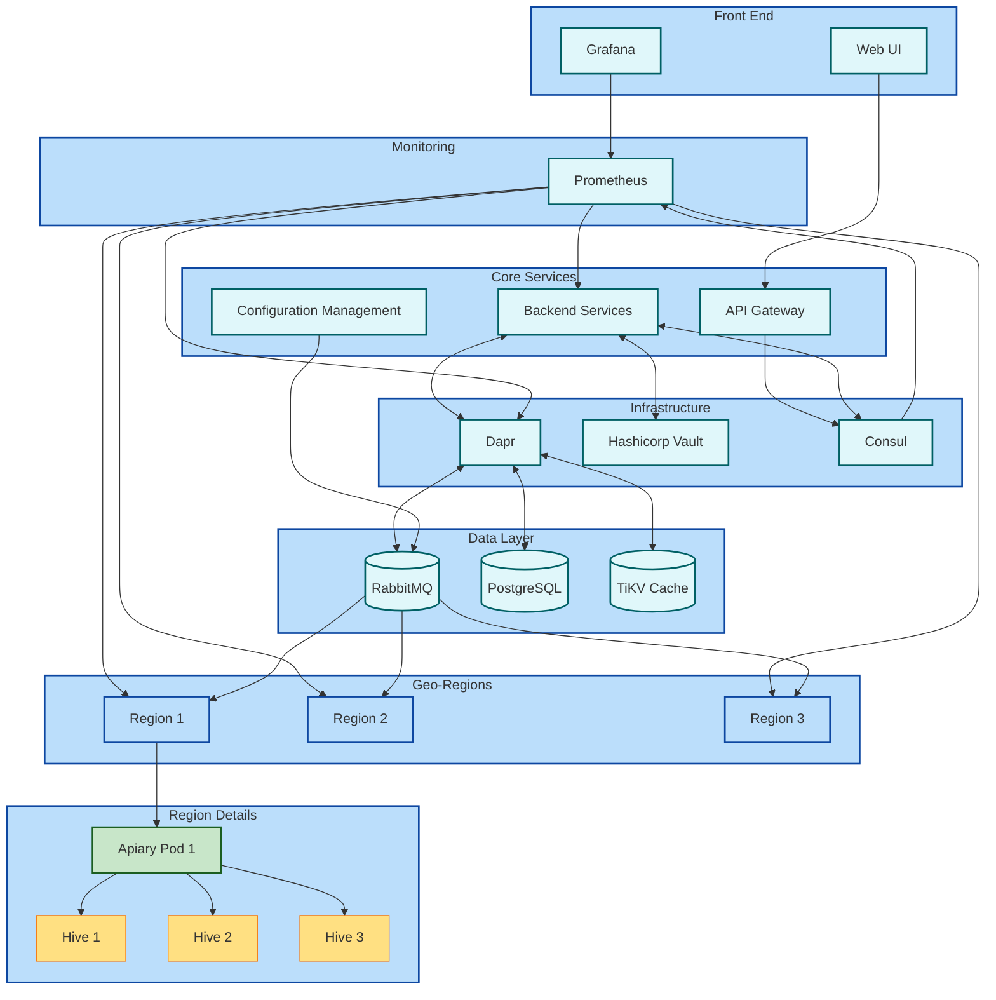

# Предметная область: гео-распределенная пасека

# Подробное текстовое описание предметной области.

## 1. Улей
- **Характеристики**: Номер улья, тип улья (например, лежак, многокорпусный), дата установки.
- **Источник**: Основы пчеловодства, где рассматриваются различные типы ульев и их использование [8].

## 2. Пчелосемья
- **Характеристики**: Номер семьи, количество пчел, состояние (здоровая, больная).
- **Источник**: Статья о контроле летной активности пчел и их состоянии [7].

## 3. Датчик температуры и влажности
- **Характеристики**: Идентификатор датчика, значения температуры и влажности, дата и время измерения.
- **Источник**: Описание систем мониторинга в пчеловодстве, где используются датчики для контроля условий в улье [7].

## 4. Запись о медосборе
- **Характеристики**: Дата сбора меда, количество собранного меда, качество.
- **Источник**: Основы пчеловодства и практики сбора меда [8].

## 5. Журнал наблюдений
- **Характеристики**: Дата записи, описание наблюдений (поведение пчел, состояние улья), рекомендации.
- **Источник**: Методические рекомендации по ведению журнала наблюдений за пчелами [8].

## 6. Ветеринарный паспорт
- **Характеристики**: Номер паспорта, дата выдачи, состояние здоровья пчелосемьи.
- **Источник**: Ветеринарные документы для учета здоровья животных на пасеке [8].

## 7. Система управления
- **Характеристики**: Название системы, версия программного обеспечения, дата установки.
- **Источник**: Описание программных решений для управления пасеками [7].

## 8. План обслуживания
- **Характеристики**: Дата планового обслуживания, виды работ (например, осмотр ульев), ответственный за выполнение.
- **Источник**: Рекомендации по техническому обслуживанию ульев и оборудования [7].

## 9. Инциденты
- **Характеристики**: Дата инцидента, описание (например, болезни пчел), принятые меры.
- **Источник**: Нормативные акты по регистрации инцидентов на пасеке [8].

## 10. Отчетность по производству
- **Характеристики**: Период отчета, количество произведенного меда, расходы на содержание пасеки.
- **Источник**: Статья о ведении отчетности в пчеловодстве [8].

# Зачем нужна информационная система

# Функциональные/нефункциональные требования

# Модель основных прецедентов

# Архитектура будующей системы

