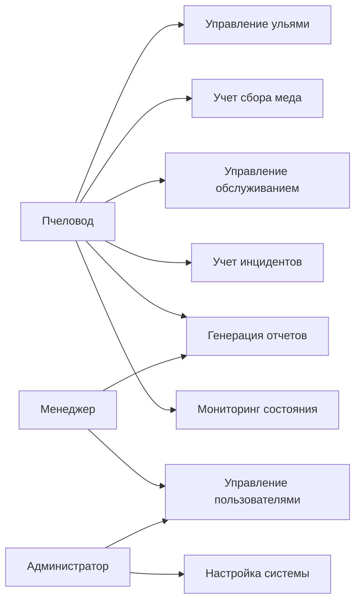
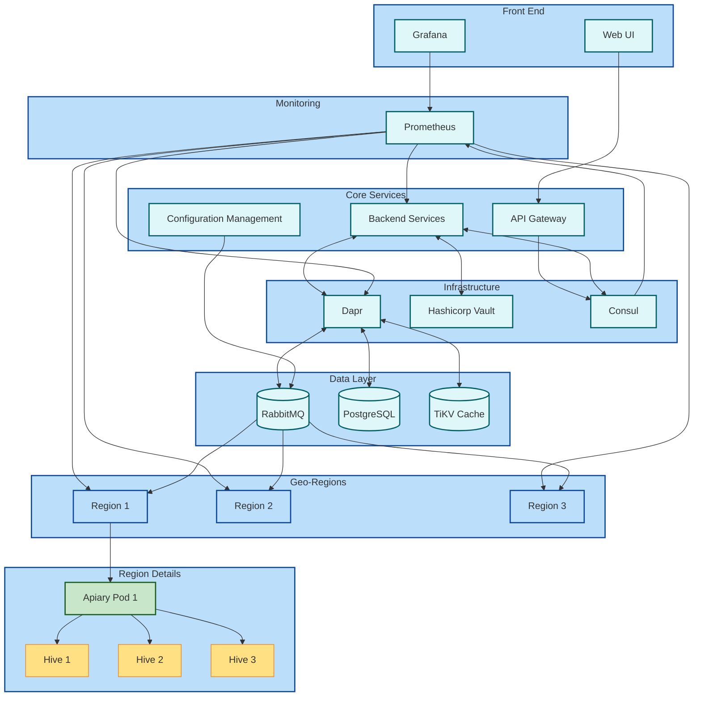

## Министерство науки и высшего образования Российской Федерации
## Федеральное государственное автономное образовательное учреждение высшего образования
## «Национальный исследовательский университет ИТМО»
## Факультет программной инженерии и компьютерной техники
**Курсовая работа (часть 1)**
по дисциплине
"Информационные системы"

<b>Выполнили студенты группы P3312:</b>

Пархоменко Кирилл Александрович  
Соколов Анатолий Владимирович

<b>Преподаватель:</b>  
Бострикова Дарья Константиновна 

г. Санкт-Петербург  

2024г.

---

# Предметная область: гео-распределенная пасека

# Подробное текстовое описание предметной области.

## 1. Улей

- **Характеристики**: Номер улья, тип улья (например, лежак, многокорпусный), дата установки.
- **Источник**: Основы пчеловодства, где рассматриваются различные типы ульев и их использование [8].

## 2. Пчелосемья

- **Характеристики**: Номер семьи, количество пчел, состояние (здоровая, больная).
- **Источник**: Статья о контроле летной активности пчел и их состоянии [7].

## 3. Датчик температуры и влажности

- **Характеристики**: Идентификатор датчика, значения температуры и влажности, дата и время измерения.
- **Источник**: Описание систем мониторинга в пчеловодстве, где используются датчики для контроля условий в улье [7].

## 4. Запись о медосборе

- **Характеристики**: Дата сбора меда, количество собранного меда, качество.
- **Источник**: Основы пчеловодства и практики сбора меда [8].

## 5. Журнал наблюдений

- **Характеристики**: Дата записи, описание наблюдений (поведение пчел, состояние улья), рекомендации.
- **Источник**: Методические рекомендации по ведению журнала наблюдений за пчелами [8].

## 6. Ветеринарный паспорт

- **Характеристики**: Номер паспорта, дата выдачи, состояние здоровья пчелосемьи.
- **Источник**: Ветеринарные документы для учета здоровья животных на пасеке [8].

## 7. Система управления

- **Характеристики**: Название системы, версия программного обеспечения, дата установки.
- **Источник**: Описание программных решений для управления пасеками [7].

## 8. План обслуживания

- **Характеристики**: Дата планового обслуживания, виды работ (например, осмотр ульев), ответственный за выполнение.
- **Источник**: Рекомендации по техническому обслуживанию ульев и оборудования [7].

## 9. Инциденты

- **Характеристики**: Дата инцидента, описание (например, болезни пчел), принятые меры.
- **Источник**: Нормативные акты по регистрации инцидентов на пасеке [8].

## 10. Отчетность по производству

- **Характеристики**: Период отчета, количество произведенного меда, расходы на содержание пасеки.
- **Источник**: Статья о ведении отчетности в пчеловодстве [8].

# Зачем нужна информационная система

# Функциональные/нефункциональные требования

## 1. Функциональные требования

1.1. Система должна обеспечивать добавление ульев, редактирование и удаление информации об ульях, включая номер, тип и дату установки

1.2.Система должна вести записи о датах сбора меда, количестве собранного меда и качестве меда.

1.3.Система должна вести записи о датах проведения плановых обслуживаний, видах работ и ответственных за выполнение.

1.4.Система должна вести записи о датах и описании инцидентов, принятых мерах.

1.5. Система должна обеспечивать уведомления о критических изменениях в состоянии ульев или при
возникновении инцидентов.

1.6. Система должна поддерживать экспорт данных в различных форматах (CSV, JSON).

## 2. Нефункциональные требования

2.1. Система должна быть доступна 99.9% времени.

2.2. Система должна защищать данные от несанкционированного доступа, включая аутентификацию и авторизацию пользователей.

2.3 Система должна быть устойчивой к сбоям и отказам, обеспечивая сохранность данных путем резервного копирования.

2.4. Система должна обеспечивать масштабируемость для поддержки роста числа ульев и обработки большего объема данных.

2.5. Система должна обеспечивать быстрый отклик при выполнении операций, не превышающий 2 секунд.

# Модель основных прецедентов

# Архитектура будующей системы

