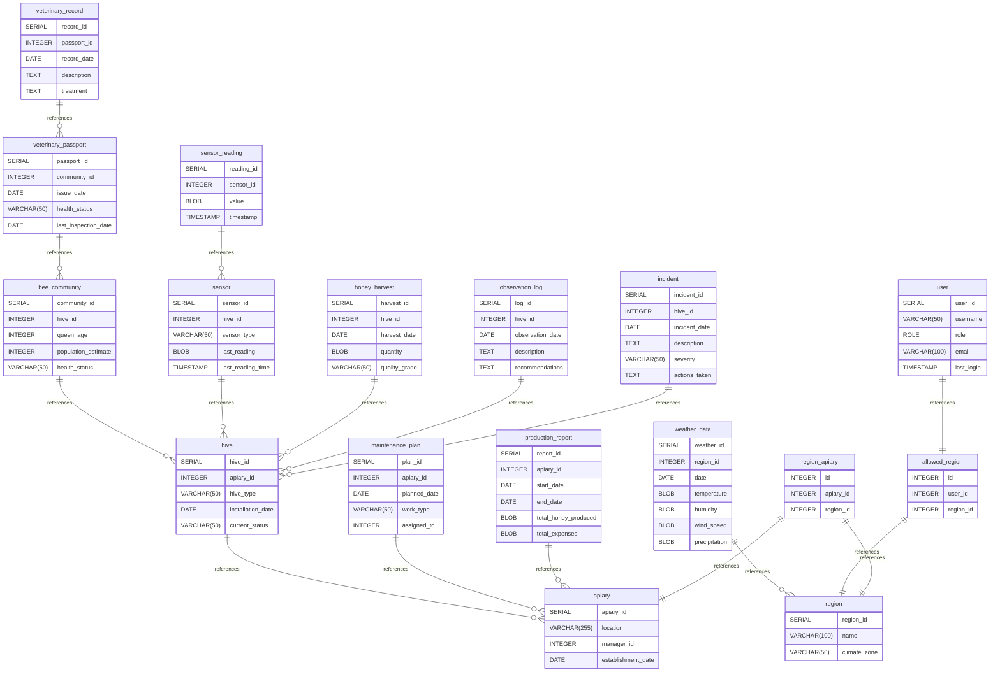

# part2_definition documentation

## Summary

- [Introduction](#introduction)
- [Database Type](#database-type)
- [Table Structure](#table-structure)
  - [region](#region)
  - [apiary](#apiary)
  - [hive](#hive)
  - [bee_community](#bee_community)
  - [veterinary_passport](#veterinary_passport)
  - [veterinary_record](#veterinary_record)
  - [sensor](#sensor)
  - [sensor_reading](#sensor_reading)
  - [honey_harvest](#honey_harvest)
  - [observation_log](#observation_log)
  - [maintenance_plan](#maintenance_plan)
  - [incident](#incident)
  - [production_report](#production_report)
  - [weather_data](#weather_data)
  - [user](#user)
  - [allowed_region](#allowed_region)
  - [region_apiary](#region_apiary)
- [Relationships](#relationships)
- [Database Diagram](#database-Diagram)

## Introduction

## Database type

- **Database system:** PostgreSQL

## Table structure

### region

| Name             | Type         | Settings        | References | Note |
| ---------------- | ------------ | --------------- | ---------- | ---- |
| **region_id**    | SERIAL       | 🔑 PK, not null |            |      |
| **name**         | VARCHAR(100) | not null        |            |      |
| **climate_zone** | VARCHAR(50)  | not null        |            |      |

### apiary

| Name                   | Type         | Settings        | References | Note |
| ---------------------- | ------------ | --------------- | ---------- | ---- |
| **apiary_id**          | SERIAL       | 🔑 PK, not null |            |      |
| **location**           | VARCHAR(255) | not null        |            |      |
| **manager_id**         | INTEGER      | not null        |            |      |
| **establishment_date** | DATE         | not null        |            |      |

### hive

| Name                  | Type        | Settings        | References        | Note |
| --------------------- | ----------- | --------------- | ----------------- | ---- |
| **hive_id**           | SERIAL      | 🔑 PK, not null |                   |      |
| **apiary_id**         | INTEGER     | not null        | Hive_apiary_id_fk |      |
| **hive_type**         | VARCHAR(50) | not null        |                   |      |
| **installation_date** | DATE        | not null        |                   |      |
| **current_status**    | VARCHAR(50) | not null        |                   |      |

### bee_community

| Name                    | Type        | Settings        | References              | Note |
| ----------------------- | ----------- | --------------- | ----------------------- | ---- |
| **community_id**        | SERIAL      | 🔑 PK, not null |                         |      |
| **hive_id**             | INTEGER     | not null        | BeeCommunity_hive_id_fk |      |
| **queen_age**           | INTEGER     | not null        |                         |      |
| **population_estimate** | INTEGER     | not null        |                         |      |
| **health_status**       | VARCHAR(50) | not null        |                         |      |

### veterinary_passport

| Name                     | Type        | Settings        | References                         | Note |
| ------------------------ | ----------- | --------------- | ---------------------------------- | ---- |
| **passport_id**          | SERIAL      | 🔑 PK, not null |                                    |      |
| **community_id**         | INTEGER     | not null        | VeterinaryPassport_community_id_fk |      |
| **issue_date**           | DATE        | not null        |                                    |      |
| **health_status**        | VARCHAR(50) | not null        |                                    |      |
| **last_inspection_date** | DATE        | not null        |                                    |      |

### veterinary_record

| Name            | Type    | Settings        | References                      | Note |
| --------------- | ------- | --------------- | ------------------------------- | ---- |
| **record_id**   | SERIAL  | 🔑 PK, not null |                                 |      |
| **passport_id** | INTEGER | not null        | VeterinaryRecord_passport_id_fk |      |
| **record_date** | DATE    | not null        |                                 |      |
| **description** | TEXT    | not null        |                                 |      |
| **treatment**   | TEXT    | not null        |                                 |      |

### sensor

| Name                  | Type        | Settings        | References        | Note |
| --------------------- | ----------- | --------------- | ----------------- | ---- |
| **sensor_id**         | SERIAL      | 🔑 PK, not null |                   |      |
| **hive_id**           | INTEGER     | not null        | Sensor_hive_id_fk |      |
| **sensor_type**       | VARCHAR(50) | not null        |                   |      |
| **last_reading**      | BLOB        | not null        |                   |      |
| **last_reading_time** | TIMESTAMP   | not null        |                   |      |

### sensor_reading

| Name           | Type      | Settings        | References                 | Note |
| -------------- | --------- | --------------- | -------------------------- | ---- |
| **reading_id** | SERIAL    | 🔑 PK, not null |                            |      |
| **sensor_id**  | INTEGER   | not null        | SensorReading_sensor_id_fk |      |
| **value**      | BLOB      | not null        |                            |      |
| **timestamp**  | TIMESTAMP | not null        |                            |      |

### honey_harvest

| Name              | Type        | Settings        | References              | Note |
| ----------------- | ----------- | --------------- | ----------------------- | ---- |
| **harvest_id**    | SERIAL      | 🔑 PK, not null |                         |      |
| **hive_id**       | INTEGER     | not null        | HoneyHarvest_hive_id_fk |      |
| **harvest_date**  | DATE        | not null        |                         |      |
| **quantity**      | BLOB        | not null        |                         |      |
| **quality_grade** | VARCHAR(50) | not null        |                         |      |

### observation_log

| Name                 | Type    | Settings        | References                | Note |
| -------------------- | ------- | --------------- | ------------------------- | ---- |
| **log_id**           | SERIAL  | 🔑 PK, not null |                           |      |
| **hive_id**          | INTEGER | not null        | ObservationLog_hive_id_fk |      |
| **observation_date** | DATE    | not null        |                           |      |
| **description**      | TEXT    | not null        |                           |      |
| **recommendations**  | TEXT    | not null        |                           |      |

### maintenance_plan

| Name             | Type        | Settings        | References                   | Note |
| ---------------- | ----------- | --------------- | ---------------------------- | ---- |
| **plan_id**      | SERIAL      | 🔑 PK, not null |                              |      |
| **apiary_id**    | INTEGER     | not null        | MaintenancePlan_apiary_id_fk |      |
| **planned_date** | DATE        | not null        |                              |      |
| **work_type**    | VARCHAR(50) | not null        |                              |      |
| **assigned_to**  | INTEGER     | not null        |                              |      |

### incident

| Name              | Type        | Settings        | References          | Note |
| ----------------- | ----------- | --------------- | ------------------- | ---- |
| **incident_id**   | SERIAL      | 🔑 PK, not null |                     |      |
| **hive_id**       | INTEGER     | not null        | Incident_hive_id_fk |      |
| **incident_date** | DATE        | not null        |                     |      |
| **description**   | TEXT        | not null        |                     |      |
| **severity**      | VARCHAR(50) | not null        |                     |      |
| **actions_taken** | TEXT        | not null        |                     |      |

### production_report

| Name                     | Type    | Settings        | References                    | Note |
| ------------------------ | ------- | --------------- | ----------------------------- | ---- |
| **report_id**            | SERIAL  | 🔑 PK, not null |                               |      |
| **apiary_id**            | INTEGER | not null        | ProductionReport_apiary_id_fk |      |
| **start_date**           | DATE    | not null        |                               |      |
| **end_date**             | DATE    | not null        |                               |      |
| **total_honey_produced** | BLOB    | not null        |                               |      |
| **total_expenses**       | BLOB    | not null        |                               |      |

### weather_data

| Name              | Type    | Settings        | References               | Note |
| ----------------- | ------- | --------------- | ------------------------ | ---- |
| **weather_id**    | SERIAL  | 🔑 PK, not null |                          |      |
| **region_id**     | INTEGER | not null        | WeatherData_region_id_fk |      |
| **date**          | DATE    | not null        |                          |      |
| **temperature**   | BLOB    | not null        |                          |      |
| **humidity**      | BLOB    | not null        |                          |      |
| **wind_speed**    | BLOB    | not null        |                          |      |
| **precipitation** | BLOB    | not null        |                          |      |

### user

| Name           | Type         | Settings          | References      | Note |
| -------------- | ------------ | ----------------- | --------------- | ---- |
| **user_id**    | SERIAL       | 🔑 PK, not null   | User_user_id_fk |      |
| **username**   | VARCHAR(50)  | not null , unique |                 |      |
| **role**       | ROLE         | not null          |                 |      |
| **email**      | VARCHAR(100) | not null , unique |                 |      |
| **last_login** | TIMESTAMP    | not null          |                 |      |

### allowed_region

| Name          | Type    | Settings                                | References                  | Note |
| ------------- | ------- | --------------------------------------- | --------------------------- | ---- |
| **id**        | INTEGER | 🔑 PK, not null , unique, autoincrement |                             |      |
| **user_id**   | INTEGER | not null                                |                             |      |
| **region_id** | INTEGER | not null                                | AllowedRegions_region_id_fk |      |

### region_apiary

| Name          | Type    | Settings                                | References                 | Note |
| ------------- | ------- | --------------------------------------- | -------------------------- | ---- |
| **id**        | INTEGER | 🔑 PK, not null , unique, autoincrement |                            |      |
| **apiary_id** | INTEGER | not null                                | region_apiary_apiary_id_fk |      |
| **region_id** | INTEGER | not null                                | region_apiary_region_id_fk |      |

## Relationships

- **hive to apiary**: many_to_one
- **bee_community to hive**: many_to_one
- **veterinary_passport to bee_community**: many_to_one
- **veterinary_record to veterinary_passport**: many_to_one
- **sensor to hive**: many_to_one
- **sensor_reading to sensor**: many_to_one
- **honey_harvest to hive**: many_to_one
- **observation_log to hive**: many_to_one
- **maintenance_plan to apiary**: many_to_one
- **incident to hive**: many_to_one
- **production_report to apiary**: many_to_one
- **weather_data to region**: many_to_one
- **user to allowed_region**: one_to_one
- **allowed_region to region**: one_to_one
- **region_apiary to apiary**: one_to_one
- **region_apiary to region**: one_to_one

## Database Diagram

## Database Scripts

### DDL (Data Definition Language)

The `ddl.sql` file contains the SQL statements for creating the database schema. It includes:

1. Creation of all tables listed in the [Table Structure](#table-structure) section.
2. Definition of primary keys, foreign keys, and other constraints.
3. Setting up of enumerated types (e.g., ROLE for the user table).
4. Creation of sequences for auto-incrementing fields.

Key features:

- Uses SERIAL type for auto-incrementing primary keys.
- Implements NOT NULL constraints on essential fields.
- Establishes foreign key relationships between tables.

### Data Population (populate.sql)

The `populate.sql` script populates the database with initial data. It includes:

1. INSERT statements for each table in a logical order to satisfy foreign key constraints.
2. Sample data for:
   - Regions and climate zones
   - Apiaries and their locations
   - Hives and bee communities
   - Users with different roles
   - Sensor data and readings
   - Honey harvest records
   - Weather data
   - Maintenance plans and incidents

This script ensures that the database has a realistic dataset for testing and development purposes.

### Triggers (trigger.sql)

The `trigger.sql` file defines several triggers to maintain data integrity and automate certain processes:

1. `update_last_reading_trigger`: Updates the `last_reading` and `last_reading_time` in the `sensor` table whenever a new sensor reading is inserted.

2. `update_hive_status_trigger`: Automatically updates the `current_status` of a hive based on recent sensor readings and incidents.

3. `log_user_login_trigger`: Records the `last_login` timestamp in the `user` table whenever a user logs in.

4. `validate_harvest_quantity_trigger`: Ensures that the honey harvest quantity is within a reasonable range before insertion.

5. `update_community_health_trigger`: Updates the `health_status` of a bee community based on recent veterinary records.

These triggers help maintain data consistency and automate routine updates across related tables.

### Indexes (indexes.sql)

The `indexes.sql` script creates indexes to optimize query performance:

1. `idx_hive_apiary`: Index on `apiary_id` in the `hive` table for faster joins with the `apiary` table.

2. `idx_sensor_reading_timestamp`: Index on `timestamp` in the `sensor_reading` table for efficient time-based queries.

3. `idx_honey_harvest_date`: Composite index on `hive_id` and `harvest_date` in the `honey_harvest` table for optimizing harvest reports.

4. `idx_weather_data_region_date`: Composite index on `region_id` and `date` in the `weather_data` table for efficient weather lookups.

5. `idx_user_username`: Index on `username` in the `user` table for fast user authentication.

These indexes are designed to improve the performance of common queries in the beekeeping management system.

### Functions (functions.sql)

The `functions.sql` file defines several useful functions for data analysis and management:

1. `calculate_average_honey_yield(hive_id INT, start_date DATE, end_date DATE) RETURNS DECIMAL`:
   Calculates the average honey yield for a specific hive over a given time period.

2. `get_hive_health_status(hive_id INT) RETURNS VARCHAR`:
   Determines the overall health status of a hive based on recent sensor readings and veterinary records.

3. `find_optimal_harvest_time(apiary_id INT) RETURNS DATE`:
   Suggests the optimal time for honey harvesting based on weather data and hive conditions.

4. `calculate_apiary_productivity(apiary_id INT, year INT) RETURNS DECIMAL`:
   Computes the overall productivity of an apiary for a given year, considering honey yield and expenses.

5. `generate_maintenance_report(apiary_id INT) RETURNS TABLE`:
   Creates a comprehensive maintenance report for an apiary, including upcoming tasks and recent incidents.

These functions encapsulate complex business logic and provide reusable components for querying and analyzing the beekeeping data.

## Usage Instructions

To set up and populate the database:

1. Execute `ddl.sql` to create the database schema.
2. Run `indexes.sql` to create the performance-optimizing indexes.
3. Apply `trigger.sql` to set up the automated data management triggers.
4. Execute `functions.sql` to add the analytical and utility functions.
5. Finally, run `populate.sql` to insert the initial dataset.

Ensure you run these scripts in the specified order to avoid dependency issues.

## Maintenance and Updates

When updating the database:

1. Modify the relevant SQL files as needed.
2. Update `populate.sql` if changes affect the sample data structure.
3. After significant changes, consider rebuilding indexes for optimal performance.
4. Test all triggers and functions to ensure they remain compatible with any structural changes.
5. Keep this documentation updated to reflect all modifications.
