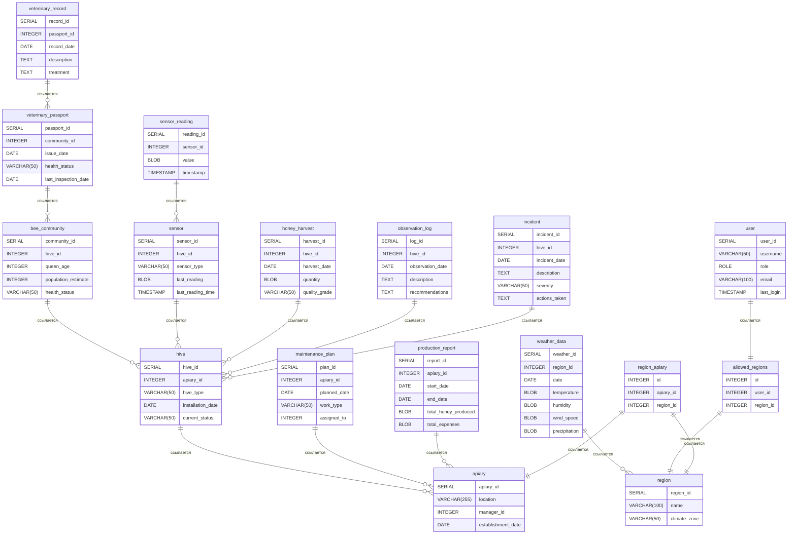

<div align="center">

## Министерство науки и высшего образования Российской Федерации
## Федеральное государственное автономное образовательное учреждение высшего образования
## «Национальный исследовательский университет ИТМО»
## Факультет программной инженерии и компьютерной техники
**Курсовая работа (часть 1)**

по дисциплине
"Информационные системы"
</div>

<div align="right" style="margin-top: 50px;">
<b>Выполнили студенты группы P3312:</b>

Пархоменко Кирилл Александрович
Соколов Анатолий Владимирович

<b>Преподаватель:</b>
Бострикова Дарья Константиновна
</div>


<div align="center" style="margin-top: 200px; text: center">
г. Санкт-Петербург

2024г.
</div>

<div style="page-break-after: always;"></div>

## Содержание

- [Введение](#введение)
- [Тип базы данных](#тип-базы-данных)
- [Структура таблиц](#структура-таблиц)
  - [region](#region)
  - [apiary](#apiary)
  - [hive](#hive)
  - [bee_community](#bee_community)
  - [veterinary_passport](#veterinary_passport)
  - [veterinary_record](#veterinary_record)
  - [sensor](#sensor)
  - [sensor_reading](#sensor_reading)
  - [honey_harvest](#honey_harvest)
  - [observation_log](#observation_log)
  - [maintenance_plan](#maintenance_plan)
  - [incident](#incident)
  - [production_report](#production_report)
  - [weather_data](#weather_data)
  - [user](#user)
  - [allowed_regions](#allowed_regions)
  - [region_apiary](#region_apiary)
- [Связи](#связи)
- [Диаграмма базы данных](#диаграмма-базы-данных)

## Введение

## Тип базы данных

- **Система управления базами данных:** PostgreSQL

## Структура таблиц

### region

| Название         | Тип          | Настройки       | Ссылки | Примечание |
| ---------------- | ------------ | --------------- | ------ | ---------- |
| **region_id**    | SERIAL       | 🔑 PK, not null |        |            |
| **name**         | VARCHAR(100) | not null        |        |            |
| **climate_zone** | VARCHAR(50)  | not null        |        |            |

### apiary

| Название               | Тип          | Настройки       | Ссылки | Примечание |
| ---------------------- | ------------ | --------------- | ------ | ---------- |
| **apiary_id**          | SERIAL       | 🔑 PK, not null |        |            |
| **location**           | VARCHAR(255) | not null        |        |            |
| **manager_id**         | INTEGER      | not null        |        |            |
| **establishment_date** | DATE         | not null        |        |            |

### hive

| Название              | Тип         | Настройки       | Ссылки             | Примечание |
| --------------------- | ----------- | --------------- | ------------------ | ---------- |
| **hive_id**           | SERIAL      | 🔑 PK, not null |                    |            |
| **apiary_id**         | INTEGER     | not null        | Hive_apiary_id_fk  |            |
| **hive_type**         | VARCHAR(50) | not null        |                    |            |
| **installation_date** | DATE        | not null        |                    |            |
| **current_status**    | VARCHAR(50) | not null        |                    |            |

### bee_community

| Название                | Тип         | Настройки       | Ссылки                   | Примечание |
| ----------------------- | ----------- | --------------- | ------------------------ | ---------- |
| **community_id**        | SERIAL      | 🔑 PK, not null |                          |            |
| **hive_id**             | INTEGER     | not null        | BeeCommunity_hive_id_fk  |            |
| **queen_age**           | INTEGER     | not null        |                          |            |
| **population_estimate** | INTEGER     | not null        |                          |            |
| **health_status**       | VARCHAR(50) | not null        |                          |            |

### veterinary_passport

| Название                 | Тип         | Настройки       | Ссылки                              | Примечание |
| ------------------------ | ----------- | --------------- | ----------------------------------- | ---------- |
| **passport_id**          | SERIAL      | 🔑 PK, not null |                                     |            |
| **community_id**         | INTEGER     | not null        | VeterinaryPassport_community_id_fk  |            |
| **issue_date**           | DATE        | not null        |                                     |            |
| **health_status**        | VARCHAR(50) | not null        |                                     |            |
| **last_inspection_date** | DATE        | not null        |                                     |            |

### veterinary_record

| Название        | Тип     | Настройки       | Ссылки                           | Примечание |
| --------------- | ------- | --------------- | -------------------------------- | ---------- |
| **record_id**   | SERIAL  | 🔑 PK, not null |                                  |            |
| **passport_id** | INTEGER | not null        | VeterinaryRecord_passport_id_fk  |            |
| **record_date** | DATE    | not null        |                                  |            |
| **description** | TEXT    | not null        |                                  |            |
| **treatment**   | TEXT    | not null        |                                  |            |

### sensor

| Название              | Тип         | Настройки       | Ссылки             | Примечание |
| --------------------- | ----------- | --------------- | ------------------ | ---------- |
| **sensor_id**         | SERIAL      | 🔑 PK, not null |                    |            |
| **hive_id**           | INTEGER     | not null        | Sensor_hive_id_fk  |            |
| **sensor_type**       | VARCHAR(50) | not null        |                    |            |
| **last_reading**      | BLOB        | not null        |                    |            |
| **last_reading_time** | TIMESTAMP   | not null        |                    |            |

### sensor_reading

| Название       | Тип       | Настройки       | Ссылки                      | Примечание |
| -------------- | --------- | --------------- | --------------------------- | ---------- |
| **reading_id** | SERIAL    | 🔑 PK, not null |                             |            |
| **sensor_id**  | INTEGER   | not null        | SensorReading_sensor_id_fk  |            |
| **value**      | BLOB      | not null        |                             |            |
| **timestamp**  | TIMESTAMP | not null        |                             |            |

### honey_harvest

| Название          | Тип         | Настройки       | Ссылки                   | Примечание |
| ----------------- | ----------- | --------------- | ------------------------ | ---------- |
| **harvest_id**    | SERIAL      | 🔑 PK, not null |                          |            |
| **hive_id**       | INTEGER     | not null        | HoneyHarvest_hive_id_fk  |            |
| **harvest_date**  | DATE        | not null        |                          |            |
| **quantity**      | BLOB        | not null        |                          |            |
| **quality_grade** | VARCHAR(50) | not null        |                          |            |

### observation_log

| Название             | Тип     | Настройки       | Ссылки                     | Примечание |
| -------------------- | ------- | --------------- | -------------------------- | ---------- |
| **log_id**           | SERIAL  | 🔑 PK, not null |                            |            |
| **hive_id**          | INTEGER | not null        | ObservationLog_hive_id_fk  |            |
| **observation_date** | DATE    | not null        |                            |            |
| **description**      | TEXT    | not null        |                            |            |
| **recommendations**  | TEXT    | not null        |                            |            |

### maintenance_plan

| Название         | Тип         | Настройки       | Ссылки                        | Примечание |
| ---------------- | ----------- | --------------- | ----------------------------- | ---------- |
| **plan_id**      | SERIAL      | 🔑 PK, not null |                               |            |
| **apiary_id**    | INTEGER     | not null        | MaintenancePlan_apiary_id_fk  |            |
| **planned_date** | DATE        | not null        |                               |            |
| **work_type**    | VARCHAR(50) | not null        |                               |            |
| **assigned_to**  | INTEGER     | not null        |                               |            |

### incident

| Название          | Тип         | Настройки       | Ссылки               | Примечание |
| ----------------- | ----------- | --------------- | -------------------- | ---------- |
| **incident_id**   | SERIAL      | 🔑 PK, not null |                      |            |
| **hive_id**       | INTEGER     | not null        | Incident_hive_id_fk  |            |
| **incident_date** | DATE        | not null        |                      |            |
| **description**   | TEXT        | not null        |                      |            |
| **severity**      | VARCHAR(50) | not null        |                      |            |
| **actions_taken** | TEXT        | not null        |                      |            |

### production_report

| Название                 | Тип     | Настройки       | Ссылки                         | Примечание |
| ------------------------ | ------- | --------------- | ------------------------------ | ---------- |
| **report_id**            | SERIAL  | 🔑 PK, not null |                                |            |
| **apiary_id**            | INTEGER | not null        | ProductionReport_apiary_id_fk  |            |
| **start_date**           | DATE    | not null        |                                |            |
| **end_date**             | DATE    | not null        |                                |            |
| **total_honey_produced** | BLOB    | not null        |                                |            |
| **total_expenses**       | BLOB    | not null        |                                |            |

### weather_data

| Название          | Тип     | Настройки       | Ссылки                    | Примечание |
| ----------------- | ------- | --------------- | ------------------------- | ---------- |
| **weather_id**    | SERIAL  | 🔑 PK, not null |                           |            |
| **region_id**     | INTEGER | not null        | WeatherData_region_id_fk  |            |
| **date**          | DATE    | not null        |                           |            |
| **temperature**   | BLOB    | not null        |                           |            |
| **humidity**      | BLOB    | not null        |                           |            |
| **wind_speed**    | BLOB    | not null        |                           |            |
| **precipitation** | BLOB    | not null        |                           |            |

### user

| Название       | Тип          | Настройки         | Ссылки           | Примечание |
| -------------- | ------------ | ------------------ | ---------------- | ---------- |
| **user_id**    | SERIAL       | 🔑 PK, not null    | User_user_id_fk  |            |
| **username**   | VARCHAR(50)  | not null , unique  |                  |            |
| **role**       | ROLE         | not null           |                  |            |
| **email**      | VARCHAR(100) | not null , unique  |                  |            |
| **last_login** | TIMESTAMP    | not null           |                  |            |

### allowed_regions

| Название      | Тип     | Настройки                               | Ссылки                       | Примечание |
| ------------- | ------- | --------------------------------------- | ---------------------------- | ---------- |
| **id**        | INTEGER | 🔑 PK, not null , unique, autoincrement |                              |            |
| **user_id**   | INTEGER | not null                                |                              |            |
| **region_id** | INTEGER | not null                                | AllowedRegions_region_id_fk  |            |

### region_apiary

| Название      | Тип     | Настройки                               | Ссылки                      | Примечание |
| ------------- | ------- | --------------------------------------- | --------------------------- | ---------- |
| **id**        | INTEGER | 🔑 PK, not null , unique, autoincrement |                             |            |
| **apiary_id** | INTEGER | not null                                | region_apiary_apiary_id_fk  |            |
| **region_id** | INTEGER | not null                                | region_apiary_region_id_fk  |            |

## Связи

- **hive к apiary**: многие к одному
- **bee_community к hive**: многие к одному
- **veterinary_passport к bee_community**: многие к одному
- **veterinary_record к veterinary_passport**: многие к одному
- **sensor к hive**: многие к одному
- **sensor_reading к sensor**: многие к одному
- **honey_harvest к hive**: многие к одному
- **observation_log к hive**: многие к одному
- **maintenance_plan к apiary**: многие к одному
- **incident к hive**: многие к одному
- **production_report к apiary**: многие к одному
- **weather_data к region**: многие к одному
- **user к allowed_regions**: один к одному
- **allowed_regions к region**: один к одному
- **region_apiary к apiary**: один к одному
- **region_apiary к region**: один к одному

## Диаграмма базы данных


```mermaid
erDiagram
	hive ||--o{ apiary : ссылается
	bee_community ||--o{ hive : ссылается
	veterinary_passport ||--o{ bee_community : ссылается
	veterinary_record ||--o{ veterinary_passport : ссылается
	sensor ||--o{ hive : ссылается
	sensor_reading ||--o{ sensor : ссылается
	honey_harvest ||--o{ hive : ссылается
	observation_log ||--o{ hive : ссылается
	maintenance_plan ||--o{ apiary : ссылается
	incident ||--o{ hive : ссылается
	production_report ||--o{ apiary : ссылается
	weather_data ||--o{ region : ссылается
	user ||--|| allowed_regions : ссылается
	allowed_regions ||--|| region : ссылается
	region_apiary ||--|| apiary : ссылается
	region_apiary ||--|| region : ссылается

	region {
		SERIAL region_id
		VARCHAR(100) name
		VARCHAR(50) climate_zone
	}

	apiary {
		SERIAL apiary_id
		VARCHAR(255) location
		INTEGER manager_id
		DATE establishment_date
	}

	hive {
		SERIAL hive_id
		INTEGER apiary_id
		VARCHAR(50) hive_type
		DATE installation_date
		VARCHAR(50) current_status
	}

	bee_community {
		SERIAL community_id
		INTEGER hive_id
		INTEGER queen_age
		INTEGER population_estimate
		VARCHAR(50) health_status
	}

	veterinary_passport {
		SERIAL passport_id
		INTEGER community_id
		DATE issue_date
		VARCHAR(50) health_status
		DATE last_inspection_date
	}

	veterinary_record {
		SERIAL record_id
		INTEGER passport_id
		DATE record_date
		TEXT description
		TEXT treatment
	}

	sensor {
		SERIAL sensor_id
		INTEGER hive_id
		VARCHAR(50) sensor_type
		BLOB last_reading
		TIMESTAMP last_reading_time
	}

	sensor_reading {
		SERIAL reading_id
		INTEGER sensor_id
		BLOB value
		TIMESTAMP timestamp
	}

	honey_harvest {
		SERIAL harvest_id
		INTEGER hive_id
		DATE harvest_date
		BLOB quantity
		VARCHAR(50) quality_grade
	}

	observation_log {
		SERIAL log_id
		INTEGER hive_id
		DATE observation_date
		TEXT description
		TEXT recommendations
	}

	maintenance_plan {
		SERIAL plan_id
		INTEGER apiary_id
		DATE planned_date
		VARCHAR(50) work_type
		INTEGER assigned_to
	}

	incident {
		SERIAL incident_id
		INTEGER hive_id
		DATE incident_date
		TEXT description
		VARCHAR(50) severity
		TEXT actions_taken
	}

	production_report {
		SERIAL report_id
		INTEGER apiary_id
		DATE start_date
		DATE end_date
		BLOB total_honey_produced
		BLOB total_expenses
	}

	weather_data {
		SERIAL weather_id
		INTEGER region_id
		DATE date
		BLOB temperature
		BLOB humidity
		BLOB wind_speed
		BLOB precipitation
	}

	user {
		SERIAL user_id
		VARCHAR(50) username
		ROLE role
		VARCHAR(100) email
		TIMESTAMP last_login
	}

	allowed_regions {
		INTEGER id
		INTEGER user_id
		INTEGER region_id
	}

	region_apiary {
		INTEGER id
		INTEGER apiary_id
		INTEGER region_id
	}
```

## Скрипты базы данных

### DDL (Язык определения данных)

Файл `ddl.sql` содержит SQL-инструкции для создания схемы базы данных. Он включает:

1. Создание всех таблиц, перечисленных в разделе [Структура таблиц](#структура-таблиц).
2. Определение первичных ключей, внешних ключей и других ограничений.
3. Настройку перечисляемых типов (например, ROLE для таблицы user).
4. Создание последовательностей для полей с автоинкрементом.

Ключевые особенности:

- Использует тип SERIAL для первичных ключей с автоинкрементом.
- Реализует ограничения NOT NULL для важных полей.
- Устанавливает связи внешних ключей между таблицами.

```sql
-- Add constraints and checks

\c bee_management


ALTER TABLE Apiary ADD CONSTRAINT check_establishment_date CHECK (establishment_date <= CURRENT_DATE);
ALTER TABLE Hive ADD CONSTRAINT check_installation_date CHECK (installation_date <= CURRENT_DATE);
ALTER TABLE BeeCommunity ADD CONSTRAINT check_queen_age CHECK (queen_age >= 0);
ALTER TABLE BeeCommunity ADD CONSTRAINT check_population_estimate CHECK (population_estimate >= 0);
ALTER TABLE VeterinaryPassport ADD CONSTRAINT check_issue_date CHECK (issue_date <= CURRENT_DATE);
ALTER TABLE VeterinaryPassport ADD CONSTRAINT check_last_inspection_date CHECK (last_inspection_date <= CURRENT_DATE);
ALTER TABLE VeterinaryRecord ADD CONSTRAINT check_record_date CHECK (record_date <= CURRENT_DATE);
ALTER TABLE HoneyHarvest ADD CONSTRAINT check_harvest_date CHECK (harvest_date <= CURRENT_DATE);
ALTER TABLE HoneyHarvest ADD CONSTRAINT check_quantity CHECK (quantity >= 0);
ALTER TABLE ObservationLog ADD CONSTRAINT check_observation_date CHECK (observation_date <= CURRENT_DATE);
ALTER TABLE MaintenancePlan ADD CONSTRAINT check_planned_date CHECK (planned_date >= CURRENT_DATE);
ALTER TABLE Incident ADD CONSTRAINT check_incident_date CHECK (incident_date <= CURRENT_DATE);
ALTER TABLE ProductionReport ADD CONSTRAINT check_date_range CHECK (start_date <= end_date);
ALTER TABLE ProductionReport ADD CONSTRAINT check_total_honey_produced CHECK (total_honey_produced >= 0);
ALTER TABLE WeatherData ADD CONSTRAINT check_weather_date CHECK (date <= CURRENT_DATE);

```

### Заполнение данными (populate.sql)

Скрипт `populate.sql` заполняет базу данных начальными данными. Он включает:

1. Инструкции INSERT для каждой таблицы в логическом порядке для удовлетворения ограничений внешних ключей.
2. Примеры данных для:
   - Регионов и климатических зон
   - Пасек и их местоположений
   - Ульев и пчелиных сообществ
   - Пользователей с разными ролями
   - Данных датчиков и показаний
   - Записей о сборе меда
   - Погодных данных
   - Планов обслуживания и инцидентов

Этот скрипт обеспечивает наличие в базе данных реалистичного набора данных для тестирования и разработки.


```sql
-- Connect to the database
\c bee_management

-- Function to populate the database with test data
CREATE OR REPLACE FUNCTION populate_test_data()
RETURNS VOID AS $$
BEGIN
    -- Insert test data for Region
    INSERT INTO Region (name, climate_zone) VALUES
    ('North', 'Temperate'),
    ('South', 'Mediterranean'),
    ('East', 'Continental'),
    ('West', 'Oceanic');

    -- Insert test data for Apiary
    INSERT INTO Apiary (location, establishment_date, region_id) VALUES
    ('Forest Edge', '2020-05-15', 1),
    ('Meadow', '2019-07-20', 2),
    ('Mountain Side', '2021-03-10', 3),
    ('Coastal Area', '2018-09-01', 4);

    -- Insert test data for Hive
    INSERT INTO Hive (apiary_id, installation_date) VALUES
    (1, '2020-06-01'),
    (1, '2020-06-02'),
    (2, '2019-08-01'),
    (3, '2021-04-01'),
    (4, '2018-10-01');

    -- Insert test data for BeeCommunity
    INSERT INTO BeeCommunity (hive_id, queen_age, population_estimate) VALUES
    (1, 2, 50000),
    (2, 1, 40000),
    (3, 3, 60000),
    (4, 1, 45000),
    (5, 2, 55000);

    -- Insert test data for User
    INSERT INTO "User" (username, password_hash, role) VALUES
    ('admin', 'hashed_password', 'admin'),
    ('user1', 'hashed_password', 'user'),
    ('user2', 'hashed_password', 'user');

    -- Insert test data for UserRegionAccess
    INSERT INTO UserRegionAccess (user_id, region_id) VALUES
    (2, 1),
    (2, 2),
    (3, 3),
    (3, 4);

    -- Insert test data for HoneyHarvest
    INSERT INTO HoneyHarvest (hive_id, harvest_date, quantity) VALUES
    (1, '2021-08-15', 25.5),
    (2, '2021-08-16', 22.0),
    (3, '2021-08-20', 30.5),
    (4, '2021-09-01', 28.0),
    (5, '2021-09-05', 26.5);

    -- Insert test data for ObservationLog
    INSERT INTO ObservationLog (hive_id, user_id, observation_date, notes) VALUES
    (1, 2, '2021-07-01', 'Bees appear healthy and active'),
    (2, 2, '2021-07-02', 'Queen spotted, laying eggs'),
    (3, 3, '2021-07-10', 'Hive population growing steadily'),
    (4, 3, '2021-07-15', 'Some signs of possible mite infestation'),
    (5, 2, '2021-07-20', 'Honey production looks promising');

    -- Insert test data for MaintenancePlan
    INSERT INTO MaintenancePlan (hive_id, planned_date, description) VALUES
    (1, '2021-10-01', 'Winter preparation'),
    (2, '2021-10-02', 'Winter preparation'),
    (3, '2021-10-05', 'Winter preparation'),
    (4, '2021-10-10', 'Mite treatment'),
    (5, '2021-10-15', 'Winter preparation');

    -- Insert test data for Incident
    INSERT INTO Incident (hive_id, incident_date, description) VALUES
    (4, '2021-07-20', 'Mite infestation detected');

    -- Insert test data for WeatherData
    INSERT INTO WeatherData (region_id, date, temperature, humidity, precipitation) VALUES
    (1, '2021-08-01', 25.5, 60.0, 0.0),
    (2, '2021-08-01', 28.0, 55.0, 0.0),
    (3, '2021-08-01', 23.0, 65.0, 5.0),
    (4, '2021-08-01', 22.0, 70.0, 2.0);

END;
$$ LANGUAGE plpgsql;

-- Execute the function to populate the database
SELECT populate_test_data();

-- Confirm population
SELECT 'Test data inserted successfully!' AS result;
```

### Триггеры (trigger.sql)

Файл `trigger.sql` определяет несколько триггеров для поддержания целостности данных и автоматизации определенных процессов:

1. `update_last_reading_trigger`: Обновляет `last_reading` и `last_reading_time` в таблице `sensor` при вставке нового показания датчика.

2. `update_hive_status_trigger`: Автоматически обновляет `current_status` улья на основе последних показаний датчиков и инцидентов.

3. `log_user_login_trigger`: Записывает временную метку `last_login` в таблице `user` при каждом входе пользователя в систему.

4. `validate_harvest_quantity_trigger`: Обеспечивает, чтобы количество собранного меда находилось в разумных пределах перед вставкой.

5. `update_community_health_trigger`: Обновляет `health_status` пчелиного сообщества на основе последних ветеринарных записей.

Эти триггеры помогают поддерживать согласованность данных и автоматизировать рутинные обновления в связанных таблицах.

```sql
-- Create triggers

\c bee_management

CREATE OR REPLACE FUNCTION update_last_login()
RETURNS TRIGGER AS $$
BEGIN
    NEW.last_login = CURRENT_TIMESTAMP;
    RETURN NEW;
END;
$$ LANGUAGE plpgsql;

CREATE TRIGGER update_user_last_login
BEFORE UPDATE ON "User"
FOR EACH ROW
EXECUTE FUNCTION update_last_login();

-- Create a function to grant access to all regions for admin users
CREATE OR REPLACE FUNCTION grant_admin_access()
RETURNS TRIGGER AS $$
BEGIN
    IF NEW.role = 'admin' THEN
        INSERT INTO UserRegionAccess (user_id, region_id)
        SELECT NEW.id, r.id
        FROM Region r
        ON CONFLICT (user_id, region_id) DO NOTHING;
    END IF;
    RETURN NEW;
END;
$$ LANGUAGE plpgsql;

-- Create a trigger to automatically grant access to all regions for admin users
CREATE TRIGGER admin_access_trigger
AFTER INSERT OR UPDATE ON "User"
FOR EACH ROW
EXECUTE FUNCTION grant_admin_access();

CREATE OR REPLACE FUNCTION update_population_estimate()
RETURNS TRIGGER AS $$
BEGIN
    IF TG_OP = 'INSERT' THEN
        UPDATE BeeCommunity
        SET population_estimate = population_estimate + NEW.quantity
        WHERE id = NEW.bee_community_id;
    ELSIF TG_OP = 'DELETE' THEN
        UPDATE BeeCommunity
        SET population_estimate = population_estimate - OLD.quantity
        WHERE id = OLD.bee_community_id;
    END IF;
    RETURN NULL;
END;
$$ LANGUAGE plpgsql;

CREATE TRIGGER update_bee_population
AFTER INSERT OR DELETE ON HoneyHarvest
FOR EACH ROW
EXECUTE FUNCTION update_population_estimate();

-- Trigger to automatically create a veterinary passport for new bee communities
CREATE OR REPLACE FUNCTION create_veterinary_passport()
RETURNS TRIGGER AS $$
BEGIN
    INSERT INTO VeterinaryPassport (bee_community_id, issue_date, last_inspection_date)
    VALUES (NEW.id, CURRENT_DATE, CURRENT_DATE);
    RETURN NEW;
END;
$$ LANGUAGE plpgsql;

CREATE TRIGGER new_bee_community_passport
AFTER INSERT ON BeeCommunity
FOR EACH ROW
EXECUTE FUNCTION create_veterinary_passport();

-- Trigger to update production report when new honey harvest is added
CREATE OR REPLACE FUNCTION update_production_report()
RETURNS TRIGGER AS $$
BEGIN
    INSERT INTO ProductionReport (apiary_id, start_date, end_date, total_honey_produced)
    VALUES (
        (SELECT apiary_id FROM Hive WHERE id = NEW.hive_id),
        DATE_TRUNC('month', NEW.harvest_date),
        DATE_TRUNC('month', NEW.harvest_date) + INTERVAL '1 month' - INTERVAL '1 day',
        NEW.quantity
    )
    ON CONFLICT (apiary_id, start_date, end_date)
    DO UPDATE SET total_honey_produced = ProductionReport.total_honey_produced + NEW.quantity;
    RETURN NEW;
END;
$$ LANGUAGE plpgsql;

CREATE TRIGGER update_honey_production
AFTER INSERT ON HoneyHarvest
FOR EACH ROW
EXECUTE FUNCTION update_production_report();
```

### Индексы (indexes.sql)

Скрипт `indexes.sql` создает индексы для оптимизации производительности запросов:

1. `idx_hive_apiary`: Индекс по `apiary_id` в таблице `hive` для более быстрых соединений с таблицей `apiary`.

2. `idx_sensor_reading_timestamp`: Индекс по `timestamp` в таблице `sensor_reading` для эффективных запросов на основе времени.

3. `idx_honey_harvest_date`: Составной индекс по `hive_id` и `harvest_date` в таблице `honey_harvest` для оптимизации отчетов о сборе меда.

4. `idx_weather_data_region_date`: Составной индекс по `region_id` и `date` в таблице `weather_data` для эффективного поиска погодных данных.

5. `idx_user_username`: Индекс по `username` в таблице `user` для быстрой аутентификации пользователей.

Эти индексы разработаны для повышения производительности распространенных запросов в системе управления пчеловодством.

```sql
-- Add indexes for performance

\c bee_management

CREATE INDEX idx_apiary_region ON Apiary(region_id);
CREATE INDEX idx_hive_apiary ON Hive(apiary_id);
CREATE INDEX idx_bee_community_hive ON BeeCommunity(hive_id);
CREATE INDEX idx_user_region_access_user ON UserRegionAccess(user_id);
CREATE INDEX idx_user_region_access_region ON UserRegionAccess(region_id);
CREATE INDEX idx_veterinary_passport_bee_community ON VeterinaryPassport(bee_community_id);
CREATE INDEX idx_veterinary_record_passport ON VeterinaryRecord(passport_id);
CREATE INDEX idx_honey_harvest_hive ON HoneyHarvest(hive_id);
CREATE INDEX idx_observation_log_hive ON ObservationLog(hive_id);
CREATE INDEX idx_observation_log_user ON ObservationLog(user_id);
CREATE INDEX idx_maintenance_plan_hive ON MaintenancePlan(hive_id);
CREATE INDEX idx_incident_hive ON Incident(hive_id);
CREATE INDEX idx_production_report_apiary ON ProductionReport(apiary_id);
CREATE INDEX idx_weather_data_region ON WeatherData(region_id);
```

### Функции (functions.sql)

Файл `functions.sql` определяет несколько полезных функций для анализа данных и управления:

1. `calculate_average_honey_yield(hive_id INT, start_date DATE, end_date DATE) RETURNS DECIMAL`:
   Вычисляет средний выход меда для конкретного улья за заданный период времени.

2. `get_hive_health_status(hive_id INT) RETURNS VARCHAR`:
   Определяет общее состояние здоровья улья на основе последних показаний датчиков и ветеринарных записей.

3. `find_optimal_harvest_time(apiary_id INT) RETURNS DATE`:
   Предлагает оптимальное время для сбора меда на основе погодных данных и состояния ульев.

4. `calculate_apiary_productivity(apiary_id INT, year INT) RETURNS DECIMAL`:
   Вычисляет общую продуктивность пасеки за данный год, учитывая выход меда и расходы.

5. `generate_maintenance_report(apiary_id INT) RETURNS TABLE`:
   Создает комплексный отчет о техническом обслуживании пасеки, включая предстоящие задачи и недавние инциденты.

Эти функции инкапсулируют сложную бизнес-логику и предоставляют многократно используемые компоненты для запросов и анализа данных пчеловодства.

```sql
-- 1. Функция для получения общего количества меда, собранного в конкретном улье за определенный период
CREATE OR REPLACE FUNCTION get_total_honey_harvested(
    p_hive_id INTEGER,
    p_start_date DATE,
    p_end_date DATE
) RETURNS DECIMAL AS $$
DECLARE
    total_honey DECIMAL;
BEGIN
    SELECT COALESCE(SUM(quantity::DECIMAL), 0)
    INTO total_honey
    FROM honey_harvest
    WHERE hive_id = p_hive_id
    AND harvest_date BETWEEN p_start_date AND p_end_date;

    RETURN total_honey;
END;
$$ LANGUAGE plpgsql;

-- 2. Процедура для добавления нового наблюдения в журнал
CREATE OR REPLACE PROCEDURE add_observation(
    p_hive_id INTEGER,
    p_observation_date DATE,
    p_description TEXT,
    p_recommendations TEXT
) AS $$
BEGIN
    INSERT INTO observation_log (hive_id, observation_date, description, recommendations)
    VALUES (p_hive_id, p_observation_date, p_description, p_recommendations);
END;
$$ LANGUAGE plpgsql;

-- 3. Функция для получения текущего состояния здоровья пчелиной общины
CREATE OR REPLACE FUNCTION get_community_health_status(p_community_id INTEGER)
RETURNS VARCHAR AS $$
DECLARE
    health_status VARCHAR;
BEGIN
    SELECT vp.health_status
    INTO health_status
    FROM veterinary_passport vp
    WHERE vp.community_id = p_community_id
    ORDER BY vp.last_inspection_date DESC
    LIMIT 1;

    RETURN COALESCE(health_status, 'Unknown');
END;
$$ LANGUAGE plpgsql;

-- 4. Процедура для обновления статуса улья
CREATE OR REPLACE PROCEDURE update_hive_status(
    p_hive_id INTEGER,
    p_new_status VARCHAR
) AS $$
BEGIN
    UPDATE hive
    SET current_status = p_new_status
    WHERE hive_id = p_hive_id;
END;
$$ LANGUAGE plpgsql;

-- 5. Функция для расчета средней температуры в регионе за последние N дней
CREATE OR REPLACE FUNCTION get_avg_temperature(
    p_region_id INTEGER,
    p_days INTEGER
) RETURNS DECIMAL AS $$
DECLARE
    avg_temp DECIMAL;
BEGIN
    SELECT AVG(temperature::DECIMAL)
    INTO avg_temp
    FROM weather_data
    WHERE region_id = p_region_id
    AND date >= CURRENT_DATE - p_days;

    RETURN COALESCE(avg_temp, 0);
END;
$$ LANGUAGE plpgsql;

-- 6. Процедура для назначения работника на план обслуживания
CREATE OR REPLACE PROCEDURE assign_maintenance_plan(
    p_plan_id INTEGER,
    p_user_id INTEGER
) AS $$
BEGIN
    UPDATE maintenance_plan
    SET assigned_to = p_user_id
    WHERE plan_id = p_plan_id;
END;
$$ LANGUAGE plpgsql;

-- 7. Функция для проверки доступа пользователя к региону
CREATE OR REPLACE FUNCTION has_region_access(
    p_user_id INTEGER,
    p_region_id INTEGER
) RETURNS BOOLEAN AS $$
DECLARE
    has_access BOOLEAN;
BEGIN
    SELECT EXISTS (
        SELECT 1
        FROM allowed_regions
        WHERE user_id = p_user_id AND region_id = p_region_id
    ) INTO has_access;

    RETURN has_access;
END;
$$ LANGUAGE plpgsql;

-- 8. Процедура для регистрации инцидента
CREATE OR REPLACE PROCEDURE register_incident(
    p_hive_id INTEGER,
    p_incident_date DATE,
    p_description TEXT,
    p_severity VARCHAR
) AS $$
BEGIN
    INSERT INTO incident (hive_id, incident_date, description, severity)
    VALUES (p_hive_id, p_incident_date, p_description, p_severity);
END;
$$ LANGUAGE plpgsql;

-- 9. Функция для получения последних показаний датчика
CREATE OR REPLACE FUNCTION get_latest_sensor_reading(p_hive_id INTEGER, p_sensor_type VARCHAR)
RETURNS TABLE (value BYTEA, timestamp TIMESTAMP) AS $$
BEGIN
    RETURN QUERY
    SELECT sr.value, sr.timestamp
    FROM sensor s
    JOIN sensor_reading sr ON s.sensor_id = sr.sensor_id
    WHERE s.hive_id = p_hive_id AND s.sensor_type = p_sensor_type
    ORDER BY sr.timestamp DESC
    LIMIT 1;
END;
$$ LANGUAGE plpgsql;

-- 10. Процедура для создания отчета о производстве
CREATE OR REPLACE PROCEDURE create_production_report(
    p_apiary_id INTEGER,
    p_start_date DATE,
    p_end_date DATE
) AS $$
DECLARE
    total_honey DECIMAL;
    total_expenses DECIMAL;
BEGIN
    -- Расчет общего количества собранного меда
    SELECT COALESCE(SUM(quantity::DECIMAL), 0)
    INTO total_honey
    FROM honey_harvest hh
    JOIN hive h ON hh.hive_id = h.hive_id
    WHERE h.apiary_id = p_apiary_id
    AND hh.harvest_date BETWEEN p_start_date AND p_end_date;

    -- Здесь должен быть расчет общих расходов (пример)
    total_expenses := 1000.00;

    -- Создание отчета
    INSERT INTO production_report (apiary_id, start_date, end_date, total_honey_produced, total_expenses)
    VALUES (p_apiary_id, p_start_date, p_end_date, total_honey, total_expenses);
END;
$$ LANGUAGE plpgsql;
```

## Инструкции по использованию

Для настройки и заполнения базы данных:

1. Выполните `ddl.sql` для создания схемы базы данных.
2. Запустите `indexes.sql` для создания индексов, оптимизирующих производительность.
3. Примените `trigger.sql` для настройки триггеров автоматизированного управления данными.
4. Выполните `functions.sql` для добавления аналитических и служебных функций.
5. Наконец, запустите `populate.sql` для вставки начального набора данных.

Убедитесь, что вы выполняете эти скрипты в указанном порядке, чтобы избежать проблем с зависимостями.

## Обслуживание и обновления

При обновлении базы данных:

1. Измените соответствующие SQL-файлы по мере необходимости.
2. Обновите `populate.sql`, если изменения затрагивают структуру примерных данных.
3. После значительных изменений рассмотрите возможность перестроения индексов для оптимальной производительности.
4. Протестируйте все триггеры и функции, чтобы убедиться, что они остаются совместимыми с любыми структурными изменениями.
5. Поддерживайте эту документацию в актуальном состоянии, отражая все модификации.
